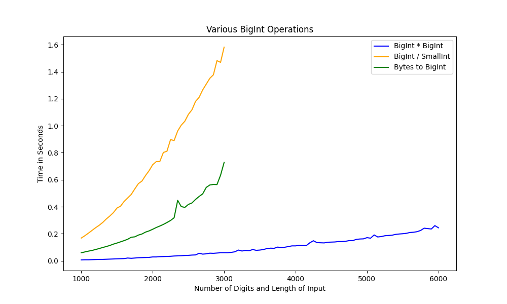

# BigInteger
Represents integers that are not able to be stored in the traditional data types

# Metrics
- Below is the time it takes to do a few of the operations in this BigInt library.
- Division is by far the slowest and it is implemented as a binary search. The graph for Mod is the same.
- The X Axis represents either the number of digits or the length of the input
  - For Multiplication it is the length of both A x B
  - For Division it is the length of A and B is just a small digit number
  - For Bytes to BigInt it is the length of the byte array

